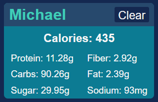
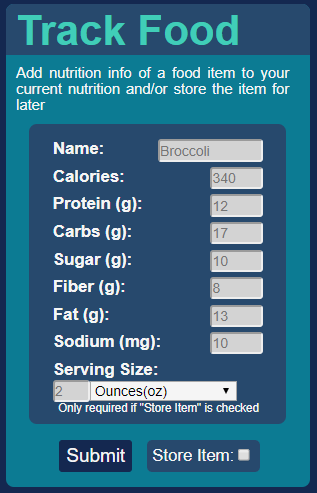
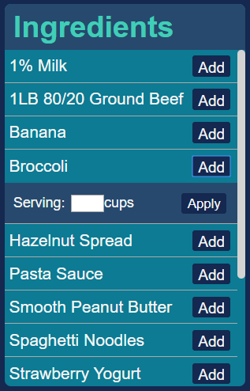

This project was bootstrapped with [Create React App](https://github.com/facebook/create-react-app).

# Nutrilyze Client

Live Version: https://nutrilyze-client.now.sh/

[Github](https://github.com/gage117/nutrilyze-client)

## Summary
React Client for tracking a user's calories and nutrition intake (carbs, protein, sodium, etc.) and be able to store foods to re-add later.

Interfaces with the Nutrilyze API [Github](https://github.com/gage117/nutrilyze-server-api)

## Screenshots

### Current Nutrition Info
Keep track of and clear user nutrition easily. 
 

### Tracking Form
Track nutrition by inputting nutrition values for foods and even store them for later use. 
 

### Quick Pick Store
Be able to choose from your list of ingredients and easily apply the nutritional value based on the serving size. 
 

## Tech Stack
- React
- React-router
- bcrypt

## Routes and Components
The components for this application are inside the /src/components folder, and their corresponding routes in the /src/routes folder.

#### Header Component
This component is used in all routes, it is a basic nav component that renders a link to the landing page, a link to login, and one to register. If the user is logged in, the login and register buttons are replaced by a logout button

### LandingRoute Route
This route is the initial page from the root route (/) and list a description of the application along with screenshots.

Components: Header, LandingPage
#### LandingPage Component
This component renders all of the landing page below the header. 

### LoginPage Route
Components: Header, Login
#### Login Component
Renders a Login form with username, password

### RegisterPage Route
Components: Header, Register
#### Register Component
Renders a Registration form with username, password, and name

### MainPage Route
Renders the components needed to make up the user's page. Including the Form for food tracking, the quick-pick store, and the user nutrition
Components: Header, ServingForm, QuickPick, UserNutrition
#### ServingForm Component
Renders a form that asks the user for details on a food to apply as well as a checkbox to tick if you'd like to store the item. Details include:
Name
Calories
Protein
Carbs
Sugar
Fiber
Fat
Sodium
Serving Size (If store-item is checked)

All values except name must be numbers

#### QuickPick Component
Renders items from database into a store that can be used to easily pull and apply items to user nutrition
Serving-size input must be a number

#### UserNutrition Component
Renders the users nutrition info into a table, with a button to clear the user's nutrition info if desired.

### NotFound Route
Renders a not found page

## Running the Application
- Clone Repo
- Install dependencies with 'npm install'
- Run tests with 'npm test'
- Start the program with 'npm start'
- This client is meant to be paired with the [Nutrilyze API Server](https://github.com/gage117/nutrilyze-server-api). Without the server running, the app will not be able to make any HTTP requests to login or register. Download the Nutrilyze API and follow it's README instructions to set up a working server to pair with this client.

## Available Scripts

In the project directory, you can run:

### `yarn start`

Runs the app in the development mode. 
Open [http://localhost:3000](http://localhost:3000) to view it in the browser.

The page will reload if you make edits. 
You will also see any lint errors in the console.

### `yarn test`

Launches the test runner in the interactive watch mode. 
See the section about [running tests](https://facebook.github.io/create-react-app/docs/running-tests) for more information.

### `yarn build`

Builds the app for production to the `build` folder. 
It correctly bundles React in production mode and optimizes the build for the best performance.

The build is minified and the filenames include the hashes. 
Your app is ready to be deployed!

See the section about [deployment](https://facebook.github.io/create-react-app/docs/deployment) for more information.

### `yarn eject`

**Note: this is a one-way operation. Once you `eject`, you can’t go back!**

If you aren’t satisfied with the build tool and configuration choices, you can `eject` at any time. This command will remove the single build dependency from your project.

Instead, it will copy all the configuration files and the transitive dependencies (Webpack, Babel, ESLint, etc) right into your project so you have full control over them. All of the commands except `eject` will still work, but they will point to the copied scripts so you can tweak them. At this point you’re on your own.

You don’t have to ever use `eject`. The curated feature set is suitable for small and middle deployments, and you shouldn’t feel obligated to use this feature. However we understand that this tool wouldn’t be useful if you couldn’t customize it when you are ready for it.

## Learn More

You can learn more in the [Create React App documentation](https://facebook.github.io/create-react-app/docs/getting-started).

To learn React, check out the [React documentation](https://reactjs.org/).

### Code Splitting

This section has moved here: https://facebook.github.io/create-react-app/docs/code-splitting

### Analyzing the Bundle Size

This section has moved here: https://facebook.github.io/create-react-app/docs/analyzing-the-bundle-size

### Making a Progressive Web App

This section has moved here: https://facebook.github.io/create-react-app/docs/making-a-progressive-web-app

### Advanced Configuration

This section has moved here: https://facebook.github.io/create-react-app/docs/advanced-configuration

### Deployment

This section has moved here: https://facebook.github.io/create-react-app/docs/deployment

### `yarn build` fails to minify

This section has moved here: https://facebook.github.io/create-react-app/docs/troubleshooting#npm-run-build-fails-to-minify
